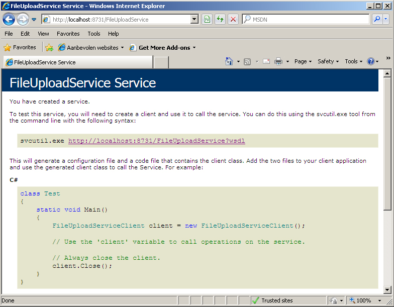

# Using WCF Services With PHP 5

## Introduction

Most of the time when I need to consume a web service I do so using a .NET client built upon the Windows Communication Foundation (WCF). In most cases the web service in question has also been developed using .NET's WCF.

About 8 years ago I used [PHP](http://www.php.net) as my primary tool for building web sites. At the time I used versions 3 & 4. Recently I had the opportunity to brush up my PHP skills by building a couple of small sites using PHP 5. Besides lending itself more towards object orientend programming I noticed that they added support for SOAP by adding the [SoapClient class](http://be.php.net/manual/en/class.soapclient.php).

As PHP is still widely used it is not unimaginable, but likely very probably that PHP developers out there need to consume a web service that has been developed with WCF. This article explains how to create WCF services that offer support for PHP clients and how such clients can consume these services.

Let's start coding...

## WCF Service

Before we can start consuming a WCF service we obviously need to create one. Let's build a web service that offers exactly one method, namely for uploading a file to the server which hosts it.

Start an instance of Visual Studio and create a new blank solution called "WcfWithPhp". Next add a WCF Service Library project and call it CGeers.Wcf.Services. A bunch of automatically generated files will be added to this project. Rename the IService1.cs file to IFileUploadService.cs and replace the generated code with the code shown in the following listing.

**Listing 1** - IFileUploadService

```csharp
[ServiceContract]
public interface IFileUploadService
{
    [OperationContract]
    bool Upload(Stream stream);
}
```

This is by far one of the simplest possible setups for a service that enables you to upload a file. The only parameter which you have to supply is the file itself (Stream parameter). Afterwards you'll receive a boolean indicating if the upload succeeded or failed.

Now let's quickly provide an implementation for this service contract. Rename the Service1.cs file to FileUploadService.cs and delete all of the boilerplate code. Your code should end up resembling the following structure:

**Listing 2** - FileUploadService

```csharp
public class FileUploadService : IFileUploadService
{
    public bool Upload(Stream stream)
    {
        try
        {
            // Generate a random filename
            // ...

            // Read the incoming stream and save it to file
            // ...
            return true;
        }
        catch (Exception)
        {
            // Gulp
            return false;
        }
    }
}
```

The listing above doesn't show you the code for the actual implementation. Don't fret about it, you can consult it in the source code accompanying this article. The code isn't optimal, but this "Hello, World"-ish example it is sufficient.

The service generates a random filename based on a Guid and then reads the incoming stream and saves it to file. Afterwards it return true. If any exceptions should occur they are swallowed and the service will return false indicating that the upload failed. It's not good practice to just swallow every possible exception, but once again this is just "illustrative code".

As a final step delete the App.config file from the WCF Service Library project. In the next step we'll setup a console application that acts as a host for our service.

## Hosting The Service

Add a new Console Application project to your solution named ConsoleHost. Add a reference to the System.ServiceModel assembly (WCF) and to the CGeers.Wcf.Services project. Then add the following code to the Main(...) method.

**Listing 3** - Hosting The Service

```csharp
static void Main()
{
    ServiceHost host = new ServiceHost(typeof(FileUploadService));
    host.Open();
    Console.WriteLine("FileUpload Service Host");
    Console.WriteLine("Service Started!");
    foreach (Uri address in host.BaseAddresses)
    {
        Console.WriteLine("Listening on " + address);
    }
    Console.WriteLine("Press any key to close the host...");
    Console.ReadLine();
    host.Close();
}
```

A service host for the FileUpload service type is created and opened. The service's configuration is included in the application's configuration file. So add an App.config file to the project and configure the service as shown below.

**Listing 4** - Configuring The Service (App.config)

```xml
<system.serviceModel>
  <services>
    <service behaviorConfiguration="MyServiceBehavior"
             name="CGeers.Wcf.Services.FileUploadService">
      <endpoint address=""
                binding="basicHttpBinding"
                contract="CGeers.Wcf.Services.IFileUploadService">
        <identity>
          <dns value="localhost" />
        </identity>
      </endpoint>
      <endpoint address="mex" binding="mexHttpBinding"
                contract="IMetadataExchange" />
      <host>
        <baseAddresses>
          <add baseAddress="http://localhost:8731/FileUploadService" />
        </baseAddresses>
      </host>
    </service>
  </services>
  <behaviors>
    <serviceBehaviors>
      <behavior name="MyServiceBehavior">
        <serviceMetadata httpGetEnabled="True"/>
        <serviceDebug includeExceptionDetailInFaults="False" />
      </behavior>
    </serviceBehaviors>
  </behaviors>
</system.serviceModel>
```

As you can see there is nothing special about this particular configuration. Two endpoints are made available, one for the service itself and another one for exposing it's metadata (mex). The transport medium is the HTTP protocol so we can choose one of the interoperable http-enabled bindings.

However since the client application will be build using PHP built-in SoapClient class we have to opt for the [basicHttpBinding](http://msdn.microsoft.com/en-us/library/ms731361.aspx) as it conform to the WS-I Basic Profile 1.1 and PHP offers no additional support for any other standards.

Run the console application to make sure it builds and executes correctly. When the application is running you should be able to enter the service's address in your favorite browser. The result should be the familiar web service test page.

**Figure 1** - FileUploadService Test Page



## PHP Client

The PHP script which consumes the service is built using PHP 5.2.0, served by Apache 2.2.3 and running on Windows XP. Your setup might differ, but make sure that your PHP 5.x version supports the SoapClient class.

Make sure that the ConsoleHost application is running while you execute your script. The actual script is surprisingly simple.

**Listing 5** - PHP Client Script

```php
<?php

// Function to read the contents of a file
function GetFileContents( $filename ) {
  $handle = fopen($filename, "r");
  $contents = fread($handle, filesize($filename));
  fclose($handle);
  return $contents;
}

// Create a new soap client based on the service's metadata (WSDL)
$client = new SoapClient("http://localhost:8731/FileUploadService?wsdl");

// Specify the file to upload
$filename = "test.txt";

// Specify the parameters for the Upload(...) method as an associative array
$parameters = array("stream" => GetFileContents($filename));

// Upload the file
$result = $client->Upload($parameters);

// Check if the upload succeeded
if ($result) {
    echo $filename . " uploaded";
}
else {
    echo $filename . " upload failed";
}

?>
```

The comments in the code adequately explains what it performs. To recap, a soap client is created using the service's metadata (WSDL), the contents of the file you want to upload are read and put in an associative array. Then the client calls the Upload method and passes in this array to actually upload the file. Finally the return value is checked to determine whether the upload succeeded.

If you execute the PHP script a couple of times you will see a number of GUID-named .dat files appearing in the same folder that hosts your ConsoleHost.exe application.

**Figure 2** - Uploaded files


While testing my script I choose to upload a simple text file (test.txt), but any file will do. Just make sure to adjust your PHP script accordingly. When uploading large files your WCF service might time out and throw an exception. You need to adjust your service's [timeout settings](<http://msdn.microsoft.com/en-us/library/system.servicemodel.channels.binding.receivetimeout(VS.85).aspx>) in this case.

## MessageContract

The "Hello, World" example I choose for this article enables you to upload a file. I particularly choose this functionality as it lends itself quite easily to implement the [MessageContract attribute](http://msdn.microsoft.com/en-us/library/system.servicemodel.messagecontractattribute.aspx). As you can see in Listing 1 the Upload(...) method only takes only one parameter, namely a stream of the file itself. When using a stream to upload a file (or any arbitrary data) it can be the only parameter passed in the body of the request.

Since we are using the HTTP transport and SOAP it can be the only parameter in the body of the soap message / envelope. If we want to send extra parameters along, then we have to insert these in the header of the request / SOAP message. This is where the MessageContract attribute comes to the rescue. It helps us shape the SOAP envelope and determine what is placed in the header and what is placed in the body of the SOAP message.

Suppose we want to send the original filename and filesize (expressed in bytes) along with the actual file itself (Stream parameter). To do this add a new class FileUploadInputParameter to the CGeers.Wcf.Services project and add the following code to it:

**Listing 6** - FileUploadInputParameter

```csharp
[MessageContract]
public class FileUploadInputParameter
{
    [MessageHeader(MustUnderstand = true)]
    public string FileName { get; set; }

    [MessageHeader(MustUnderstand = true)]
    public int FileSize { get; set; }

    [MessageBodyMember(Order = 1)]
    public Stream Stream { get; set; }
}
```

By decorating the FileUploadInputParameter class with the MessageContract attribute you define a strongly-typed class that corresponds to a SOAP message. Using the [MessageHeader](http://msdn.microsoft.com/en-us/library/system.servicemodel.messageheaderattribute.aspx) and [MessageBodyMember](http://msdn.microsoft.com/en-us/library/system.servicemodel.messagebodymemberattribute.aspx) attribute you can specify which properties of the class are respectively placed in the header and which are to be inserted in the body.

**Remark**: WCF states that when using the MessageContract attribute in your service operation that you cannot mix it with regular serializable parameters. Either only use custom message types (= class types decorated with the MessageContract attribute) or only use regular serializable parameters for the input parameters and return value of your service operation.

This means we have to use a custom message type for the return value of our service operation as well. Since this is only a boolean let's quickly wrap it in a new class type and decorate it with the necessary attributes. Add a new class FileUploadReturnValue to the CGeers.Wcf.Services project and add the code shown in Listing 7 to it.

**Listing 7** - FileUploadReturnValue

```csharp
[MessageContract]
public class FileUploadReturnValue
{
    [MessageBodyMember(Order = 1)]
    public bool UploadSucceeded { get; set; }
}
```

This message type does not include any headers and places one single boolean named UploadSucceeded in the body of the envelope.

Voila, the message contracts are in place. Let's add a new service operation to our service (IFileUploadService.cs). Very originally I've named it UploadWithMessageContract(...).

**Listing 8** - UploadWithMessageContract(...) Service Operation

```csharp
[OperationContract]
FileUploadReturnValue UploadWithMessageContract(FileUploadInputParameter file);
```

The implementation of this new service operation in the FileUploadService class is very simular to that of our regular Upload(...) method. The only difference is that instead of generating a random filename based on a Guid we use the filename provided to us. Also note that the return value (true / false) is being wrapped in our custom message type (FileUploadReturnValue).

**Listing 9** - UploadWithMessageContract Implementation

```csharp
public FileUploadReturnValue UploadWithMessageContract(FileUploadInputParameter file)
{
    try
    {
        // Read the incoming stream and save it to file
        SaveFile(file.FileName, file.Stream);
        return new FileUploadReturnValue {UploadSucceeded = true};
    }
    catch (Exception)
    {
        // Gulp
        return new FileUploadReturnValue {UploadSucceeded = false};
    }
}
```

Since the Upload(...) and UploadWithMessageContract(...) methods both use the same code for saving the incoming file I've moved this code to a separate helper method named SaveFile(string filename, Stream stream). Check the accompanying source code to see the code for this method.

## Revised PHP Client

We have to revise our PHP client a bit before we can call the new UploadWithMessageContract(...) method. Here's the adjusted code:

**Listing 10** - Revised PHP Client

```php
public FileUploadReturnValue UploadWithMessageContract(FileUploadInputParameter file)
{
    try
    {
        // Read the incoming stream and save it to file
        SaveFile(file.FileName, file.Stream);
        return new FileUploadReturnValue {UploadSucceeded = true};
    }
    catch (Exception)
    {
        // Gulp
        return new FileUploadReturnValue {UploadSucceeded = false};
    }
}
```

The only adjustments made here all the creation of the soap headers and their injection into the SOAP message. The rest is simular to that of the example shown in Listing 5. Because the response message has also been wrapped inside a custom message type the check to read the response is also slightly different.

## Summary

I hope you enjoyed this article which demonstrated the interoperability between .NET and PHP 5 using web services. Exchanging data over the HTTP transport using SOAP (v1.1) messages is a breeze between these two technologies.

Setting up your WCF service and exposing it through an endpoint which uses the httpBasicBinding enables PHP clients to consume these services through the SoapClient class. Service operations which require data to be included through the use of SOAP headers (MessageContract attribute) can also be called using PHP 5 built-in SOAP supported provided ofcourse that you include this information in the headers.

**Remark**: The source code only contains the C# code for the WCF service. The entire PHP code for creating the clients can be found in Listing 5 & 10.
